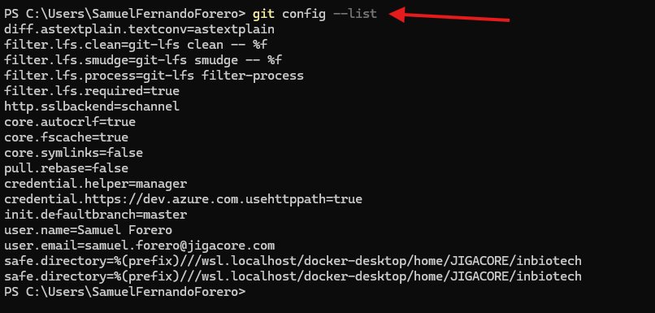
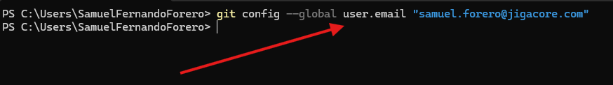
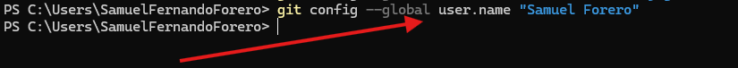
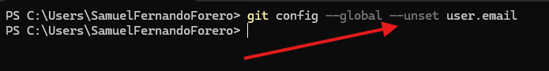
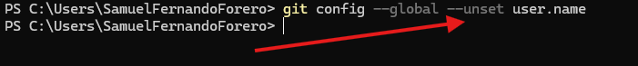
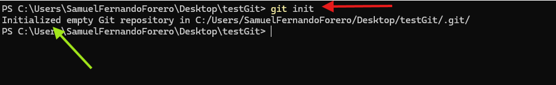
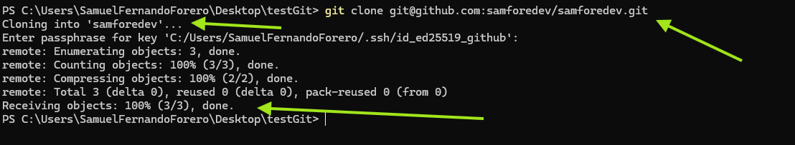

# Taller 1 Introduccion a Git y desarrollo basico

---
## Contenido
- [Introduccion](#introduccion)
  - [Objetivos del taller](#Objetivos-del-taller)
  - [Evidencias](#evidencias)
    - [Configuracion](#configuracion)
    - [Inicio basico](#inicio-basico-del-repositorio)
- [Conclusiones](#conclusiones)
- [Referencias](#referencias)

---

## Introduccion
En este taller ejecutaremos un proyecto de desarrollo basico, con principios de **POO** y aplicando  
un flujo de trabajo con **Git** y alojando el codigo en los repositorios de **GitHub**

### Objetivos del taller
El principal objetivo de este primer taller es fortalecer conceptos basicos del desarrollo en **Java**, practicando  
tanto la logica como algunas buenas practicas, ademas, de incorportar el proyecto con sistema de gestios de versiones  
el ya mecionado **Git**; esto siendo parte de una introduccion aun flujo de trabajo real que se veria en la industria.  
Finalmente nos la oportunidad de ir familiarizándonos con el lenguaje para asi proceder con mas conceptos del  desarrollo. 

### Evidencias
En esta seccion realizaremos un repaso de los diferentes comandos que tiene **Git**.  

#### Configuracion
1. Listar todas las configuraciones que tenemos en el sistema:
```bash
  git config --list
```


2. Configurar email
```bash
    git config --global user.email "samuef.dev@outlook.com"
```


3. Configurar usuario
```bash
    git config --global user.name "Samuel Forero"
```


4. Eliminar la configuracion de email
```bash
    git config --global --unset user.email
```


5. Eliminar la configuracion de usuario
```bash
    git config --global --unset user.name
```



### Inicio basico del repositorio
1. Iniciar un nuevo repositorio
```bash
    git init
```


2. Clonar un repositorio
```bash
    git clone git@github.com:samforedev/samforedev.git
```
En este caso tener en cuenta que el sistema busca una direccion valida y accesible, ademas,  
puede ser de varias formas, en este ejemplo hago el *clone* con **SSH** pero tambien puede ser,  
y es lo mas comun, por **HTTP**.  




## Conclusiones
En este taller revisamos el flujo de trabajo basico con **Git** utilizando los repositorios de **GitHub**  
aprendiendo algunos de los comandos escenciales realizando

## Referencias