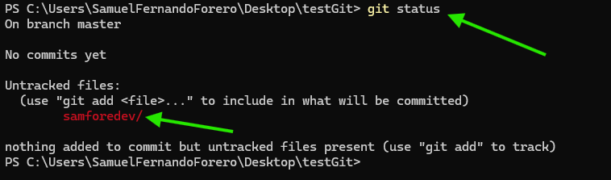
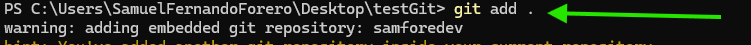
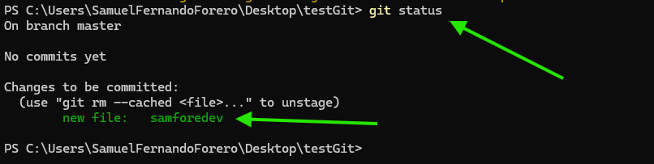
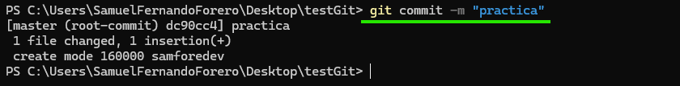
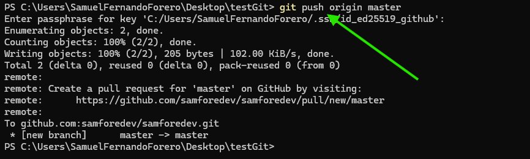
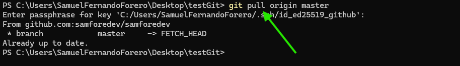

# Taller 1 Introduccion a Git y desarrollo basico

---
## Contenido
- [Introduccion](#introduccion)
  - [Objetivos del taller](#Objetivos-del-taller)
  - [Evidencias](#evidencias)
    - [Configuracion](#configuracion)
    - [Inicio basico](#inicio-basico-del-repositorio)
- [Conclusiones](#conclusiones)
- [Referencias](#referencias)

---

## Introduccion
En este taller ejecutaremos un proyecto de desarrollo basico, con principios de **POO** y aplicando  
un flujo de trabajo con **Git** y alojando el codigo en los repositorios de **GitHub**

### Objetivos del taller
El principal objetivo de este primer taller es fortalecer conceptos basicos del desarrollo en **Java**, practicando  
tanto la logica como algunas buenas practicas, ademas, de incorportar el proyecto con sistema de gestios de versiones  
el ya mecionado **Git**; esto siendo parte de una introduccion aun flujo de trabajo real que se veria en la industria.  
Finalmente nos la oportunidad de ir familiarizándonos con el lenguaje para asi proceder con mas conceptos del  desarrollo. 

### Evidencias
En esta seccion realizaremos un repaso de los diferentes comandos que tiene **Git**.  

#### Configuracion
1. Listar todas las configuraciones que tenemos en el sistema:
```bash
  git config --list
```


2. Configurar email
```bash
    git config --global user.email "samuef.dev@outlook.com"
```


3. Configurar usuario
```bash
    git config --global user.name "Samuel Forero"
```


4. Eliminar la configuracion de email
```bash
    git config --global --unset user.email
```


5. Eliminar la configuracion de usuario
```bash
    git config --global --unset user.name
```


### Manejo basico del repositorio
1. Iniciar un nuevo repositorio
```bash
    git init
```


2. Clonar un repositorio
```bash
    git clone git@github.com:samforedev/samforedev.git
```
En este caso tener en cuenta que el sistema busca una direccion valida y accesible, ademas,  
puede ser de varias formas, en este ejemplo hago el *clone* con **SSH** pero tambien puede ser,  
y es lo mas comun, por **HTTP**.  


3. Ver el estado del proyecto
```bash
  git status
```
Con git status podemos ver la rama actual, y los archivos que estan en:
* staging area
* modificados pero no en staging
* no rastreados



4. Agregar todos cambios al staging area
```bash
  git add .
```
Con este comando agregamos todos los cambios rastreados al staging area  
el area lista para el commit, el `.` al final del comando significa que agregara todo  
pero se puede aclarar que cambios queremos agregar uno por uno.





5. Realizar el commit
```bash
  git commit -m ''
```
Con este comando guardamos los cambios que estan en staging area al historial del proyecto


### Interaccion con el repositorio remoto
1. Subir los cambios al repositorio remoto
```bash
  git push origin master
```
Con este comando subimos los cambios del historial local al repositorio remoto, `origin` es el nombre  
por defecto que Git le asigna al repositorio, `master` hace referencia a la rama remota.  


2. Obtener los cambios del repositorio remoto
```bash
  git pull origin master
```
Con este comando bajamos los cambios del historial remoto al repositorio local, es lo mismo que el  
comando anterior pero a la inversa.  



### Manejo de ramas


## Conclusiones
En este taller revisamos el flujo de trabajo basico con **Git** utilizando los repositorios de **GitHub**  
aprendiendo algunos de los comandos escenciales realizando

## Referencias